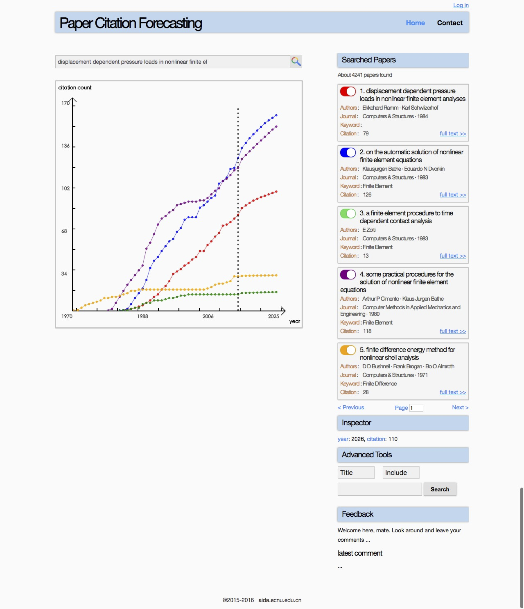

# Citation Forecasting

### Introduction

This project is a demostration for searching academic papers and forecasting their citations in the future. We build this project based on our [event sequence point process model](https://github.com/xinchrome/point_process) and [Microsoft Academic Graph](https://www.microsoft.com/en-us/research/project/microsoft-academic-graph/), and implement the server application with [Tornado](http://www.tornadoweb.org/en/stable/) and [Solr](http://lucene.apache.org/solr/).

### Modules and Components

The folder "academmic" is the main module, where we have the following subdirectories and files:

	./main.py: entry point of the server application

	./util/env_config.py: configuration files corresponding to running environment

	./controller/*: definition of request handlers of HTTP request from front end

	./service/*: definition of basic services such as searching papers, predicting citations, training models, etc.

	./static/*: static files such as css, js, etc. which can be moved to any location far away from real server side

	./template/*: templates to render

### Deployment

Dependencies are list as follows:

1. python 2.7
2. numpy >= 1.7.1
6. pysolr >= 3.3
3. tornado >= 4.3
5. solr >= 6.0

Deployment steps are list as follows:

1. Startup a solr service with port 8983.
	start: $ bin/solr start -cloud -noprompt
2. create an collection named "paper" in Solr. The url for visiting this collection should be http://localhost:8983/solr/paper .
	create collection: $ bin/solr create -c paper
	indexing data: $ bin/post -c gettingstarted docs/
	stop: $ bin/solr stop -all && rm -Rf example/cloud/
2. Download this project into an directory (project path should be english-only)
3. Insert local paper dataset to solr collection
	$ python ./preprocess/build_index.py
4. Run server
	$ python ./start.py
5. Once the server is running, you can access this engine via http://localhost:8911

### Snapshot

### Reference

X Liu, J Yan, S Xiao, X Wang, H Zha, S Chu. On Predictive Patent Valuation: Forecasting Patent Citations and Their Types. AAAI 2017.

S Xiao, J Yan, C Li, B Jin, X Wang, H Zha, X Yang, MC Stephen. On modeling and predicting individual paper citation count over time. IJCAI 2016.

